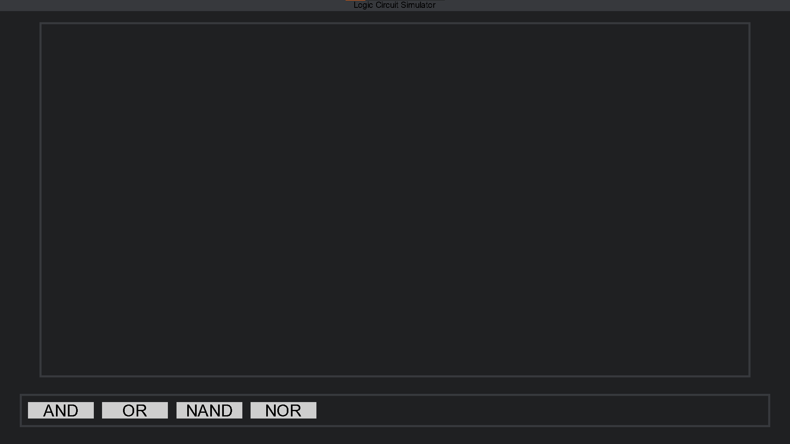

# Logic circuit simulator
> A basic logic circuit simulator written in python3. As the name suggests, it simulates logic circuit 

## Table of Contents
* [General Info](#general-information)
* [Technologies Used](#technologies-used)
* [Features](#features)
* [Screenshots](#screenshots)
* [Setup](#setup)
* [Usage](#usage)
* [Project Status](#project-status)
* [Room for Improvement](#room-for-improvement)
* [How it works](#how-it-works)

## General Information
- Logic circuit is a great way to learn how circuit components work.
- The purpose of this project is to make it easy to learn and understand the basics, without paying for such programs.

## Technologies Used
- [python](https://www.python.org/)
- [pygame](https://www.pygame.org/)

## Features
List the ready features here:
- Easy to use UI
- Variety of logic blocks
- Ability to scale things up and down

## Screenshots

## Setup
Clone the project on your local env
`git clone https://github.com/pikoonfiliq/Logic-Circuit-Simulator.git`

Change directory to that of the project
`cd Logic-Circuit-Simulator`

Install required libraries
`pip install -r requirements.txt`

## Usage
After completing the setup run the program!
`python main.py`

## Project Status
Project is: _in progress_.

## Room for Improvement
Room for improvement:
- ability to export a scheme.
- Improve program speed.

## How it works
In general:
- When clicking on the screen the program checks if the coordinates of the click coincide with a button, block or anything
- If clicked on a button, the coresponding button triggers a class of its coresponding function
- Each block, wire or border dot is saved into a list which is later used to check if a wire is connected, state or coordinates

Logic blocks, wires and border dots:
- each of the stated above is a class of its own
- they have their own draw methods, which are called when needed

Buttons:
- They too are a class
- They are dynamic - later, when the program is able to save everything on the screen as a block itself, the buttons arrange themselfves in order, color, etc.
- they too have a draw method 
